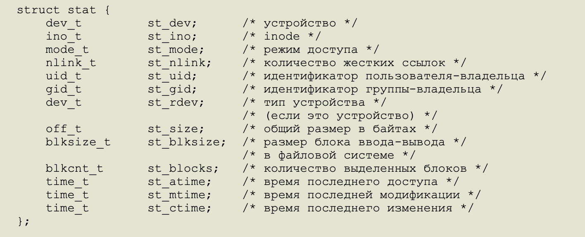
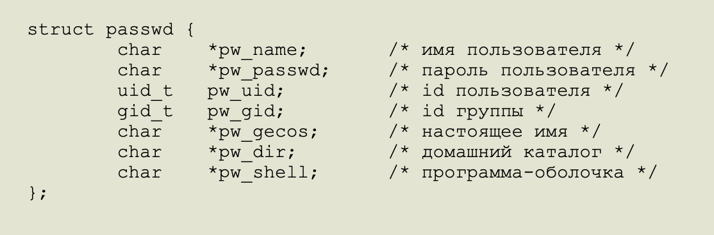
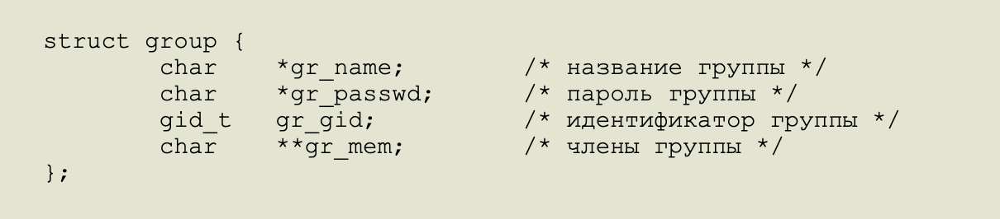

# Проект slynell `ft_ls` от Школы 21

### Воссоздание UNIX функции ls

### Реализованные флаги:
* `-l, -R, -a, -r, -t, -1`

### Используемые функции и краткое описание:

* `Opendir`:
	* Назначение - Открывает каталог;
	* Сигнатура - `DIR *opendir(const shar *name)`;
	* Ошибки:
		1. EACCES -  доступ запрещен;
		1. EMFILE - процесс использует слишком много открытых потоков;
		1. ENFILE - система использует слишком много открытых потоков;
		1. ENOENT - каталога не существует или name - пустая строка;
		1. ENOMEM - недостаточно памяти для выполнения операции;
		1. ENOTDIR - name - это не каталог.

* `Readdir`:
	* Назначение - Функция readdir() возвращает указатель на следующую запись каталога в структуре dirent, прочитанную из потока каталога. Каталог указан в dir. Функция возвращает NULL по достижении последней записи или если была обнаружена ошибка.
	* Сигнатура - `struct dirent *readdir(DIR *dir)`;
	* Ошибки:
		1. EBADF - неверный описатель потока каталога dir.

* `Closedir`:
	* Назначение - Функция closedir() закрывает поток, связанный с каталогом dir. Описатель потока dir будет недоступен после вызова этой функции.
	* Сигнатура - `int closedir(DIR *dir)`;
	* Return - Функция closedir() возвращает 0 в случае удачного завершения работы, или -1 при ошибке.
	* Ошибки:
		1. EBADF - неверный описатель потока каталога dir.

* `Stat`, `Lstat`:
	* Назначение - Эти функции возвращают информацию об указанном файле. Для этого не требуется иметь права доступа к файлу, хотя потребуются права поиска во всех каталогах, указанных в полном имени файла.
	stat возвращает информацию о файле file_name и заполняет буфер buf. lstat идентична stat, но в случае символьных сылок она возвращает информацию о самой ссылке, а не о файле, на который она указывает.
	* Сигнатура:
		1. `int stat(const char *file_name, struct stat *buf)`
		1. `int lstat(const char *file_name, struct stat *buf)`;
	* Return - В случае успеха возвращается ноль. При ошибке возвращается -1, а переменной errno присваивается номер ошибки.
	* Ошибки:
		1. EBADF -Неверный файловый описатель filedes.
		1. ENT -Компонент полного имени файла file_name не существует или полное имя является пустой строкой.
		1. TDIR - Компонент пути не является каталогом.
		1. OP - При поиске файла встретилось слишком много символьных ссылок.
		1. ULT - Некорректный адрес.
		1. CES - Запрещен доступ.
		1. MEM - Недостаточно памяти в системе.
		1. METOOLONG - Слишком длинное название файла.

* `Struct Stat`:
	* Поля:
		
	* Описание полей:
		1. `st_dev` – идентификатор устройства на котором находится файл.
		1. `st_ino` – индекс файла.
		1. `st_mod`:
			* S_IFMT	0170000	битовая маска для полей типа файла
			* S_IFSOCK	0140000	сокет
			* S_IFLNK	0120000	символьная ссылка
			* S_IFREG	0100000	обычный файл
			* S_IFBLK	0060000	блочное устройство
			* S_IFDIR	0040000	каталог
			* S_IFCHR	0020000	символьное устройство
			* S_IFIFO	0010000	канал FIFO
			* S_ISUID	0004000	бит setuid
			* S_ISGID	0002000	бит setgid (смотри ниже)
			* S_ISVTX	0001000	бит принадлежности (смотри ниже)
			* S_IRWXU	00700	маска для прав доступа пользователя
			* S_IRUSR	00400	пользователь имеет право чтения
			* S_IWUSR	00200	пользователь имеет право записи
			* S_IXUSR	00100	пользователь имеет право выполнения
			* S_IRWXG	00070	маска для прав доступа группы
			* S_IRGRP	00040	группа имеет права чтения
			* S_IWGRP	00020	группа имеет права записи
			* S_IXGRP	00010	группа имеет права выполнения
			* S_IRWXO	00007	маска прав доступа всех прочих (не находящихся в группе)
			* S_IROTH	00004	все прочие имеют права чтения
			* S_IWOTH	00002	все прочие имеют права записи
			* S_IXOTH	00001	все прочие имеют права выполнения
		1. `st_nlink` – количество жестких ссылок.
		1. `st_uid` – идентификатор пользователя владельца файла.
		1. `st_gid` – групповой идентификатор владельца.
		1. `st_rdev` - ?
		1. `st_size` - задает размер файла (если он обычный или является символьной ссылкой) в байтах. Размер символьной ссылки - длина пути файла на который она сылается, без конечного NUL.
		1. `st_blksize` - задает "предпочтительный" размер блока для эффективного ввода/вывода в файловой системе. (Запись в файл более мелкими порциями может привести к некорректному чтению/изменению/повторной записи информации).
		1. `st_blocks` - задает размер файла в 512-байтных блоках. (Оно может быть меньше, чем st_size/512 например, когда в файле есть пропуски.)
		1. `st_atime` – время последнего доступа в секундах.
		1. `st_mtime` – время последнего изменения в секундах
		1. `st_ctime` – время создания в секундах.
	* Макрасы:
		1. `S_ISLNK(mode_t st_mode)` - символьной ссылкой (Нет в POSIX.1-1996.)
		1. `S_ISREG(mode_t st_mode)` - обычным файлом
		1. `S_ISDIR(mode_t st_mode)` - каталогом
		1. `S_ISCHR(mode_t st_mode)` - символьным устройством
		1. `S_ISBLK(mode_t st_mode)`- блочным устройством
		1. `S_ISFIFO(mode_t st_mode)` - каналом FIFO
		1. `S_ISSOCK(mode_t st_mode)` - сокетом

* `Getpwuid`:
	* Назначение - Функция getpwuid() возвращает указатель на структуру, содержащую поля строки из файла /etc/passwd для записи, совпадающей с идентификатором пользователя uid.
	* Сигнатура - `struct passwd *getpwuid(uid_t uid)`;
	* Return - Функции getpwnam() и getpwuid() возвращают указатель на структуру passwd или NULL, если искомая запись не найдена или произошла ошибка.  .
	* Ошибки:
		1. 0 или ENOENT или ESRCH или EBADF или EPERM или ... Заданное name или gid не найдены.
		1. ENOMEM - Недостаточно памяти для размещения структуры passwd.
		1. EIO - Ошибка ввода/вывода.
		1. EINTR - Был пойман сигнал.
		1. EMFILE - В вызывающем процессе достигнуто максимальное число (OPEN_MAX) файлов.
		1. ENFILE - В системе уже достигнуто максимальное число файлов.

* `Struct Passwd`:
	* Поля:
		

* `Getgrgid`:
	* Назначение - Функция getgrgid() возвращает указатель на структуру, содержащую информацию из файла /etc/group о группе, идентификатор которой совпадает с gid.
	* Сигнатура - `struct group *getgrgid(gid_t gid)`;
	* Return - Функции getgrnam() и getgrgid() возвращают указатель на структуру с информацией о группе или NULL, если соответствующий элемент не найден или если произошла ошибка. При ошибках переменная errno соответственно устанавливается.
	Возвращаемое значение может указывать на статическую область, но может быть переопределено последующимим вызовами.
	* Ошибки:
		1. 0 или ENOENT или ESRCH или EBADF или EPERM или ... Заданное name или gid не найдены.
		1. ENOMEM - Недостаточно памяти для размещения структуры passwd.
		1. EIO - Ошибка ввода/вывода.
		1. EINTR - Был пойман сигнал.
		1. EMFILE - В вызывающем процессе достигнуто максимальное число (OPEN_MAX) файлов.
		1. ENFILE - В системе уже достигнуто максимальное число файлов.

* `Struct Group`:
	* Поля:
		

* `Readlink`:
	* Назначение - readlink помещает содержимое символьной ссылки path в буфер buf длиной bufsiz . readlink не добавляет в buf символ NUL. Если файл, помещаемый в буфер, слишком мал, его длина bufsiz будет урезана.
	* Сигнатура - `int readlink(const char *path, char *buf, size_t bufsiz)`;
	* Return - Этот вызов возвращает количество символов, помещенных в буфер, или (при ошибках) возвращается -1, и переменной errno присваивается номер ошибки.
	* Ошибки:
		1. ENOTDIR - Один из компонентов пути не является каталогом.
		1. EINVAL - bufsiz не является положительным числом.
		1. ENAMETOOLONG - Путь или компонент пути слишком длинный.
		1. ENOENT - Указанного файла не существует.
		1. EACCES - Запрещен поиск в каталоге, являющемся компонентом пути.
		1. ELOOP - Слишком много символьных ссылок в указанном имени.
		1. EINVAL - Файл не является символьной ссылкой.
		1. EIO - При чтении данных файловой системы произошла ошибка ввода-вывода.
		1. EFAULT - buf указывает на каталог за пределами доступного адресного пространства.
		1. ENOMEM - Недостаточно памяти в системе.

### Для изучения `dscl`, `POSIX`
